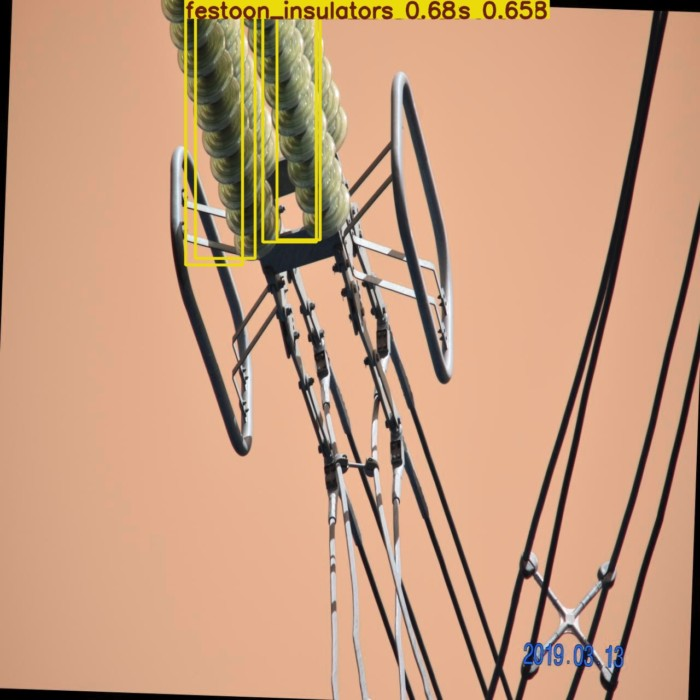

# ⚡ High-Voltage Power Line Monitoring System

[](https://lep-detector-mvp-v2.streamlit.app/) 
> **🎯 Click the badge above or [click here](https://lep-detector-mvp-v2.streamlit.app/) to try the Live Demo!**

An automated AI-driven solution for monitoring power line infrastructure using state-of-the-art object detection models. This project focuses on identifying power towers, insulators, and detecting potential structural defects.
<p><h2>Detection examples</h2></p>
<p>


  </p>
  <p>


</p>

## 🚀 Overview
Manual inspection of power lines is dangerous and time-consuming. This project demonstrates how Computer Vision can automate the process, providing real-time detection and health monitoring of critical electrical infrastructure.

### Key Features
* **Multi-Object Detection:** Real-time localization of transmission towers and insulators.
* **Fault Identification:** Specifically trained to recognize damaged components and environmental risks.
* **Dual-Model Comparison:** Implementation and testing of both **YOLOv8n** and the latest **YOLOv11n** architectures.
* **Interactive Web UI:** A user-friendly Streamlit interface for quick image inference and testing.
* **Django Backend:** Scalable architecture for future API integration and data management.

## 📊 Model Performance & Comparison

I evaluated two versions of the YOLO (You Only Look Once) architecture to find the optimal balance between inference speed and detection accuracy.

| Metric | YOLOv8n (Baseline) | YOLOv11n (Optimized) |
| :--- | :---: | :---: |
| **Model Weight (.pt)** | ~6.2 MB | **~5.4 MB** |
| **Precision** | 0.7937 | **0.7986** |
| **Recall** | 0.5403 | **0.5545** |
| **mAP@50** | 0.6033 | **0.6112** |
| **mAP@50-95** | 0.4086 | **0.4202** |
| **speed inference** | **85.6ms** | 89.9ms |

Training and testing were conducted on CPU (AMD Ryzen 5 5600U)


### 📈 Comparative Analysis: YOLOv8 vs YOLOv11  
The training results demonstrate a clear advantage of the **YOLOv11n** architecture for this specific dataset:  
- **Higher Precision & Recall:** YOLOv11n shows more stable growth and reaches higher peak values compared to YOLOv8n.  
- **Superior mAP Performance:** The mAP@50 metrics confirm that YOLOv11n provides better overall localization and classification accuracy for power line components.
- **Convergence:** YOLOv11n converges faster, showing better performance even in the early epochs.

## 🛠 Tech Stack
* **Frameworks:** Python 3.10, PyTorch, Django 5.2.
* **Computer Vision:** Ultralytics YOLOv8/v11, OpenCV.
* **Deployment:** Streamlit Cloud (Demo), Mamba/Conda (Environment).

## 📂 Project Structure
```text
├── ml_models/           # Pre-trained weights (.pt) for v8 and v11
├── streamlit_demo/      # Interactive demo application
├── lep_project/         # Django project core & detector app
├── requirements.txt     # Python dependencies for cloud deployment
├── packages.txt         # Linux system dependencies
└── environment.yml      # Mamba/Conda environment configuration
```

## 💻 Getting Started
1. Clone and Setup
```
git clone https://github.com/StasevichStas/LEP_detector_backend.git
cd lep_project

mamba env create -f environment.yml
mamba activate lep_monitoring
```
2. Run Streamlit Demo
```
streamlit run lep_project/streamlit_demo/app.py
```
The screenshot below shows the model selection and the result of power line detection.


4. Run Django Backend
```
cd lep_project
python manage.py migrate
python manage.py runserver
```
